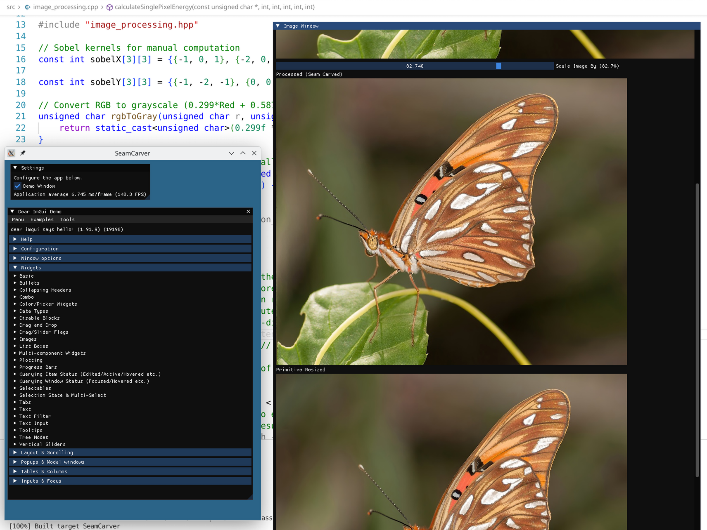

# SeamCarver

**Content-aware image resizing using seam carving algorithm**

<!-- Replace with actual screenshot or GIF of the application -->


> Real-time seam carving implementation in C++17 with OpenGL rendering. Intelligently resizes images by removing low-energy seams while preserving important visual content.

**Project Focus**: Algorithm implementation, performance optimization, and computer vision fundamentals demonstration.
---


## Features

- **Content-Aware Resizing** — Removes low-energy seams to preserve important image features
- **Real-Time Performance** — Hybrid optimization achieves ~31ms resize (12x faster than naive approach)
- **Interactive UI** — Slider-based control with immediate visual feedback via Dear ImGui
- **Side-by-Side Comparison** — View original, seam-carved, and bilinear-resized images simultaneously
- **Dual Algorithm Support** — Greedy (fast) and Dynamic Programming (optimal) seam selection

## Quick Demo

| Original | Seam Carved | Primitive Resize |
|:--------:|:-----------:|:----------------:|
| Full width | Content preserved | Distorted |

*Seam carving intelligently removes pixels along low-energy paths, preserving faces, edges, and important features that bilinear interpolation would distort.*

## How It Works

### Seam Carving Pipeline

```
Input Image → Energy Map (Sobel) → Find Seam → Remove Seam → Repeat
```

1. **Energy Map**: Compute gradient magnitude using Sobel operators — high values indicate edges/features
2. **Seam Selection**: Find connected path from top to bottom with minimal cumulative energy
3. **Seam Removal**: Shift pixels to close the gap, reducing width by 1
4. **Iterate**: Repeat until target width is reached

### Performance Optimization

The naive approach recalculates the entire energy map after each seam removal. Our hybrid optimization:

| Approach | Time (135 seams) | Strategy |
|----------|------------------|----------|
| **Naive** | 2.4 seconds | Full energy map recalculation per seam |
| **Optimized** | 31 ms | Initial OpenCV + incremental updates |

**Key insight**: After removing a seam, only ~3 pixels per row need energy recalculation (the seam's neighbors).

### Algorithm Comparison

| Algorithm | Speed | Quality | Use Case |
|-----------|-------|---------|----------|
| **Greedy** | ~60 μs/seam | Good | Interactive editing, real-time |
| **Dynamic Programming** | ~5000 μs/seam | Optimal | Offline processing, quality-critical |

## Build & Run

### Prerequisites

- CMake 3.27+
- C++17 compiler (GCC 9+, Clang 7+, MSVC 2019+)
- Git

Dependencies are automatically fetched via vcpkg (no manual installation needed).

### Build

```bash
# Release build (recommended for performance)
cmake -B build -DCMAKE_BUILD_TYPE=Release
cmake --build build -j$(nproc)

# Run
./build/SeamCarver
```

### Debug Build (with timing output)

```bash
cmake -B build -DCMAKE_BUILD_TYPE=Debug
cmake --build build -j$(nproc)
./build/SeamCarver
```

## Architecture

```
┌──────────────────────────────────────────────────────────┐
│                       SeamCarver                         │
│  (single executable, built with CMake + vcpkg toolchain) │
├──────────────────────────────────────────────────────────┤
│                                                          │
│  src/main.cpp             – entry point, event loop      │
│  src/glfw_utils.cpp       – window + ImGui helpers       │
│  src/image_processing.cpp – seam carving & resize algos  │
│                                                          │
│  include/… (matching headers)                            │
│                                                          │
└──────────────────────────────────────────────────────────┘
```

### Layers

| Layer | Responsibility |
|-------|----------------|
| **Platform/GUI** | GLFW window, OpenGL context, ImGui frame management |
| **Presentation** | ImGui windows, widgets, texture display |
| **Image Processing** | CPU algorithms: energy map, seam finding, bilinear resize |

### Tech Stack

- **GLFW** — Cross-platform window/input management
- **GLAD** — OpenGL function loader
- **Dear ImGui** — Immediate-mode GUI with docking support
- **OpenCV** — Fast Sobel gradient computation (SIMD-optimized)
- **stb_image** — Image loading
- **spdlog/fmt** — Logging and string formatting

#### About Dear ImGui

**Dear ImGui** (Immediate Mode Graphical User Interface) is a bloat-free graphical user interface library for C++. It's widely used in:

- **Game Development**: Real-time debugging tools, profilers, and in-game editors (Unity, Unreal Engine, custom engines)
- **Graphics Applications**: Shader editors, material editors, and rendering pipeline debuggers
- **Development Tools**: Profilers, memory analyzers, and performance monitoring dashboards
- **Scientific Visualization**: Interactive data visualization and parameter tuning interfaces
- **Embedded Systems Debugging**: Lightweight UI for embedded device configuration and monitoring

**Key advantages**:
- **Immediate-mode paradigm**: UI code is straightforward and declarative
- **Minimal dependencies**: Only requires an OpenGL/DirectX/Vulkan renderer
- **Fast iteration**: UI changes compile and run instantly
- **Docking support**: Professional multi-window layouts with drag-and-drop
- **Customizable**: Highly extensible styling and theming system

In this project, ImGui provides the interactive slider controls and side-by-side image comparison view, enabling real-time parameter adjustment with immediate visual feedback.

## Performance Benchmarks

Tested on 1028×695 image, reducing width by 362 pixels:

| Operation | Time | Notes |
|-----------|------|-------|
| Energy Map (OpenCV) | ~18 ms | Initial full computation |
| Energy Map (Incremental) | ~1 ms | Per-seam update |
| Seam Finding (Greedy) | ~50-70 μs | Per seam |
| Seam Removal | ~36-60 μs | Per seam |
| **Total Seam Carving** | ~1.4 s | 362 seams |
| Primitive Resize | ~10.7 ms | One-time bilinear interpolation |

## Real-World Applications & Project Value

### Where Seam Carving is Actually Used

Seam carving is primarily used in:
- **Academic/Research**: Novel compression techniques, content-aware image manipulation research
- **Artistic Image Editing**: Content-aware resizing for different aspect ratios
- **Thumbnail Generation**: Offline processing for media libraries
- **Social Media**: Automated cropping (though many platforms now use simpler center-crop approaches)

Seam carving faces challenges:
- Too slow for real-time video (even 31ms is 1 frame at 30 FPS, for a single image)
- Video codecs exploit temporal redundancy between consecutive frames
- Need consistent frame dimensions for codec pipelines
- Operators expect predictable, deterministic behavior


## Future Improvements

- **Forward Energy**: Reduce artifacts by considering energy introduced by seam removal
- **GPU Acceleration**: CUDA/OpenCL for real-time energy map computation
- **SIMD Optimization**: AVX instructions for `calculateSinglePixelEnergy`
- **Object Protection**: Mark regions to preserve or remove
- **Vertical Seams**: Support height reduction

### Important Note
The times are indicative and based on my hardware. Also, the timing has been moved to debug builds only in order to keep the release builds I/O free (concerning the printing to console) and as fast as possible. 

## License

Copyright © 2025 Stavros Kladis

## References

- [Seam Carving for Content-Aware Image Resizing](https://perso.crans.org/frenoy/matlab2012/seamcarving.pdf) — Avidan & Shamir, SIGGRAPH 2007
- [Wikipedia: Seam Carving](https://en.wikipedia.org/wiki/Seam_carving)
- [Dear ImGui Wiki](https://github.com/ocornut/imgui/wiki) — Documentation, examples, and community resources